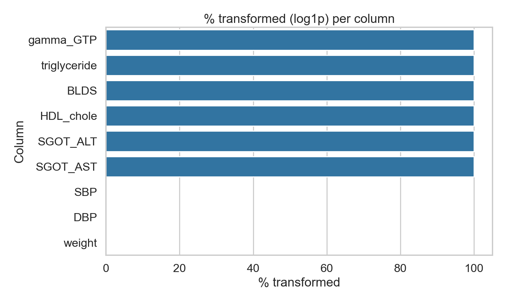
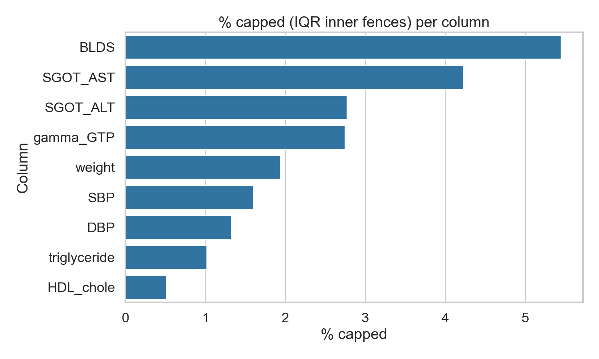
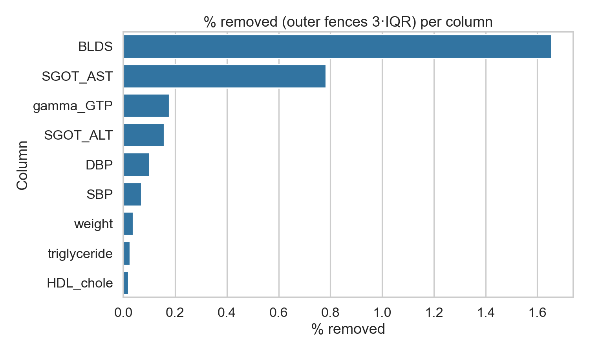

# Task 3: Outlier detection

**Dataset:** smoking_driking_dataset_Ver01.csv 

---

## a.

### Methods & Thresholds

- **Z-score detector**: flag values with |z| > **3.0** (three-sigma rule).
- **IQR detector**: flag values outside **[Q1 − 1.5·IQR, Q3 + 1.5·IQR]** (Tukey’s rule).
- **Shape diagnostics**: **skew** (asymmetry) and **kurtosis** (tail heaviness; normal ≈ 3).

We detected outliers using Z-scores with a ±3σ cutoff and the Tukey IQR rule with k=1.5. The three-sigma rule flags values beyond ±3 standard deviations as rare under approximate normality (≈0.3% outside), while the 1.5·IQR rule is robust to skew/heavy tails and aligns with the standard boxplot definition of outliers. We computed skew and kurtosis per column to find the shape of the data: near-normal shapes can rely on Z-scores; otherwise, IQR is preferred.

For all 22 columns, IQR was the better fit.

---

### Top 10 Columns by most outliers

| column       |      n |   z_outliers_count | z_outliers_ratio   |   iqr_outliers_count | iqr_outliers_ratio   |    skew |   kurtosis |
|:-------------|-------:|-------------------:|:-------------------|---------------------:|:---------------------|--------:|-----------:|
| gamma_GTP    | 991346 |              15361 | 1.55%              |                94142 | 9.5%                 |   7.719 |     97.042 |
| SGOT_ALT     | 991346 |              10370 | 1.05%              |                72928 | 7.36%                |  50.039 |   8615.94  |
| SGOT_AST     | 991346 |               5887 | 0.59%              |                67614 | 6.82%                | 150.492 |  50432.7   |
| BLDS         | 991346 |              18620 | 1.88%              |                64202 | 6.48%                |   4.617 |     40.47  |
| triglyceride | 991346 |              14631 | 1.48%              |                54104 | 5.46%                |   6.529 |    175.385 |
| weight       | 991346 |               4580 | 0.46%              |                19221 | 1.94%                |   0.577 |      0.359 |
| SBP          | 991346 |               6423 | 0.65%              |                15836 | 1.6%                 |   0.482 |      0.997 |
| HDL_chole    | 991346 |               3877 | 0.39%              |                13858 | 1.4%                 | 104.578 |  48094.2   |
| DBP          | 991346 |               6205 | 0.63%              |                13122 | 1.32%                |   0.4   |      0.892 |
| sight_left   | 991346 |               3118 | 0.31%              |                11582 | 1.17%                |   9.995 |    144.95  |

---

## b.

### Outlier handling decisions

In short
- We keep most data and “cap” only the extreme values so they don’t dominate the analysis.
- We set the caps using the IQR method.
- For very skewed measures, we first apply a log transform to make the scale more stable, then cap.
- We only remove values that are impossible or still extreme even after this.

Handling outliers per column
- Very skewed labs: gamma_GTP, SGOT_ALT, SGOT_AST, triglyceride, HDL_chole, and BLDS
  - Log1p transform, then cap to the IQR “inner fences” in the transformed scale. Keep the transformed value for modeling.
- Blood pressure (SBP, DBP) and weight
  - Cap to IQR inner fences on the original scale (no transform) to keep interpretability.
- Vision (sight_left/right)
  - Cap values to the IQR inner fences and ensure they fall within realistic limits (such as not allowing values below 0). If any values are obviously incorrect (for example, negative vision scores), set them as missing so they can be imputed later.
- Others
  - Cap with IQR on the original scale. If a variable is non‑negative and very skewed (|skew| > 1), try log1p + cap.

When do we remove?
- Only for impossible values (e.g., negatives where not allowed) or those still beyond the outer fences (3·IQR) after the above. This should be very rare.

### Visual summary

How much we transformed, capped, and would remove (per column):

## Sources

- **Empirical (three‑sigma) rule (68‑95‑99.7):**
  - Penn State (METEO 815): https://www.e-education.psu.edu/meteo815/node/7
  - MCCKC handout (PDF): https://mcckc.edu/tutoring/docs/blue-river/math/prob_stats/Normal_Distributions_and_The_Empirical_Rule.pdf

- **IQR outlier fences / Tukey’s rule (1.5·IQR, 3·IQR):**
  - NIST/ITL e‑Handbook — Outliers & box‑plot fences: https://www.itl.nist.gov/div898/handbook/prc/section1/prc16.htm
  - ASA proceedings note on Tukey constants (inner=1.5, outer=3.0): https://ww2.amstat.org/meetings/proceedings/2013/data/assets/handouts/310115_83897.pdf

- **Skew & kurtosis definitions:**
  - NIST/ITL e‑Handbook — Measures of Skewness and Kurtosis: https://www.itl.nist.gov/div898/handbook/eda/section3/eda35b.htm
